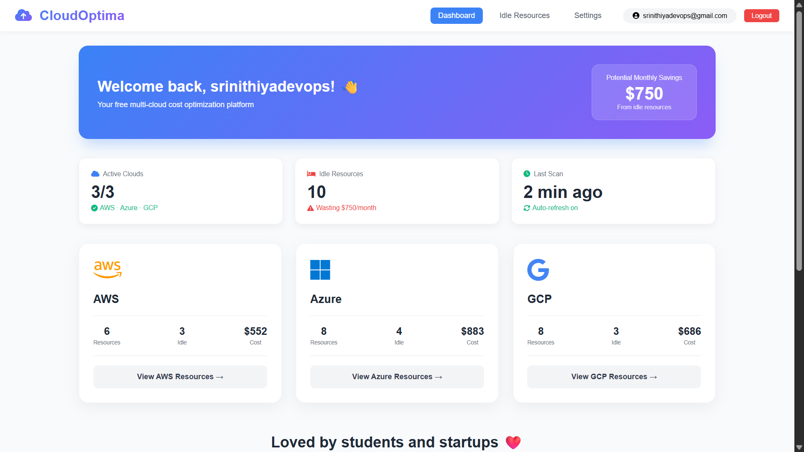
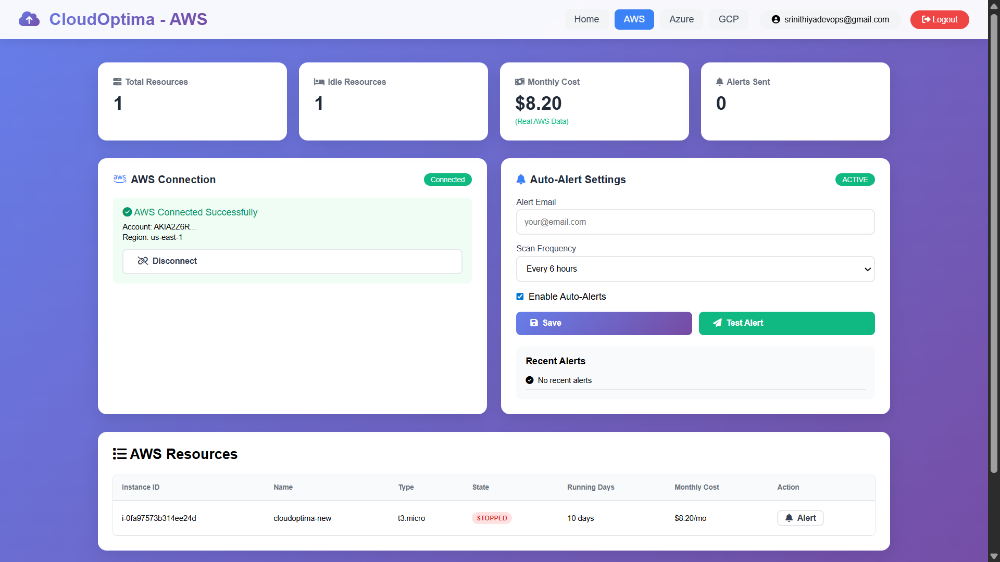
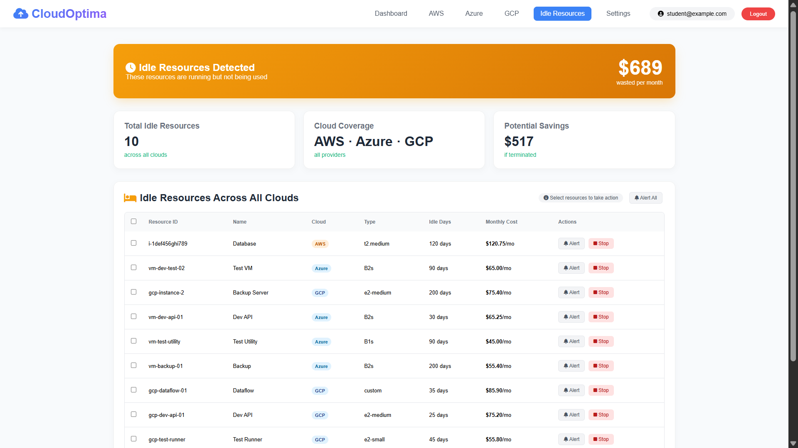

# ☁️ CloudOptima – Multi-Cloud Cost Optimization & Idle Resource Detection Platform


CloudOptima is a multi-cloud cost optimization platform that helps organizations monitor cloud resources and identify idle infrastructure to reduce unnecessary cloud spending.

It provides a centralized dashboard for AWS, Azure, and GCP with automated alerts and real-time insights.

---

## 🚀 Live Demo

- 🌐 Frontend: https://cloudoptima.vercel.app  
- ⚙️ Backend API: https://cloudoptima-api-python.onrender.com  

---

## 📌 Problem Statement

Organizations using multiple cloud providers often face difficulty in tracking unused resources, leading to high operational costs.

CloudOptima solves this by detecting idle resources and providing actionable insights to optimize cloud usage.

---

## ✨ Features

- Unified multi-cloud dashboard (AWS, Azure, GCP)  
- Real-time AWS resource monitoring using boto3  
- Idle resource detection based on usage thresholds  
- Cost estimation and savings insights  
- Automated email alerts (Brevo integration)  
- JWT-based authentication system  
- Admin dashboard with analytics  

---

## 🖼️ Screenshots

### 🌐 Multi-Cloud Dashboard
Overview of AWS, Azure, and GCP resources with cost insights and usage metrics.



---

### ☁️ AWS Resource Monitoring
Real-time AWS EC2 resource tracking with cost and status visibility.



---

### ⚠️ Idle Resource Detection
Automatically identifies unused resources and highlights potential cost savings.



---

## 🧠 System Architecture
User
↓
Frontend (Vercel)
↓
Flask API (Render)
↓
Cloud APIs (AWS boto3)
↓
PostgreSQL Database
↓
Alert System (Email Notifications)


---

## ⚙️ DevOps Workflow

- Source Code → GitHub  
- CI/CD → Auto deployment via Vercel & Render  
- Backend → Flask + Gunicorn  
- Monitoring → Resource usage tracking  
- Alerting → Email notifications via Brevo  

---

## 🛠️ Tech Stack

### Frontend
- HTML  
- CSS  
- JavaScript  
- Chart.js  

### Backend
- Python  
- Flask  
- Gunicorn  

### Database
- PostgreSQL  

### Cloud & APIs
- AWS boto3  
- Brevo Email API  

---

## ⚙️ Installation

```bash
git clone https://github.com/srinithiyadev/cloudoptima.git
cd backend
pip install -r requirements.txt
python app.py

## 📈 Future Enhancements
Azure & GCP real-time API integration
Kubernetes cluster cost monitoring
Terraform automation
Auto resource shutdown scheduler
Role-Based Access Control (RBAC)

## 👩‍💻 Author
Srinithiya M
